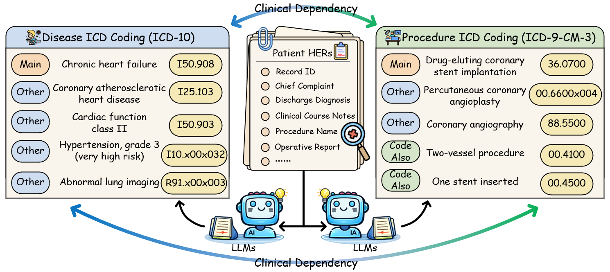
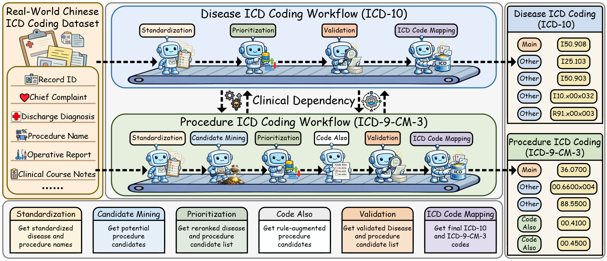
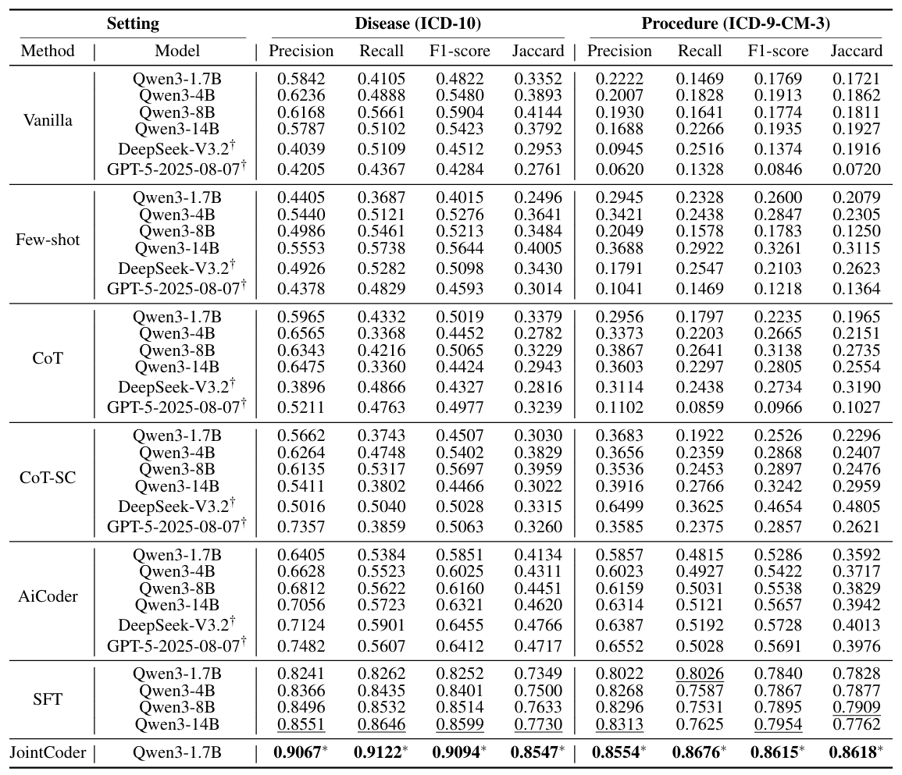
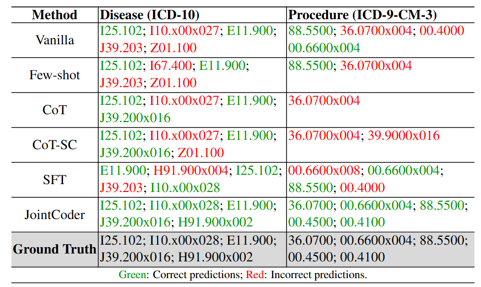
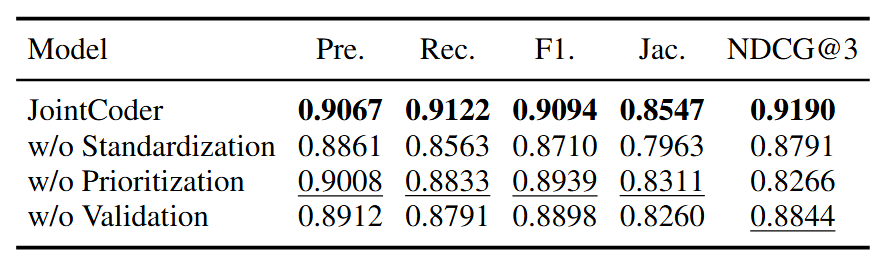
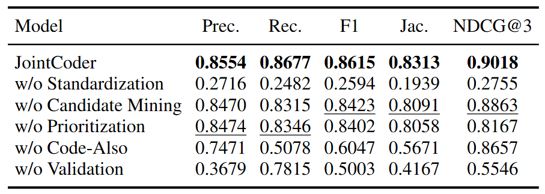
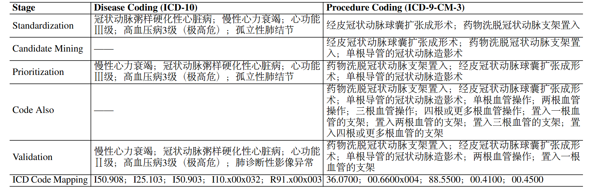

 
   
# JointCoder
This repository provides the official implementation of the paper **“Who Fights Best? Discovering Winning Personality Pairings for LLM Debate Agents”**, including the MBTI-DB framework, personality-conditioned debate prompts, experimental code, evaluation scripts, and released results, enabling reproducible research and further exploration of personality-driven multi-agent debate in large language models.

   

**Figure1**: Overview of the automated ICD coding task. Given patient EHRs, the goal is to jointly predict ICD-10 disease codes and ICD-9-CM-3 procedure codes, where disease and procedure coding are clinically correlated.

## ✨ Overview

**Figure2**: Overview of the JointCoder framework and the real-world Chinese ICD coding dataset. JointCoder jointly performs ICD-10 disease coding and ICD-9-CM-3 procedure coding through a unified, workflow-aligned multi-stage multi-agent framework.

## 🌐 Demo Website
**Our demo website is available at [this link.](http://159.89.222.214:9028/)**

The system provides four core functions:

1. **Select Demo Cases**  
   Users can choose from four preloaded EHR samples (Sample 4 contains no surgical record). The system performs OCR-based content extraction and de-identification, allows content review and editing, and then runs disease and procedure coding in parallel. Agent outputs are expandable/collapsible, and final ICD results are displayed in tables and saved to the database.

2. **Upload a Single PDF File**  
   Users can upload a local PDF EHR file. The system applies OCR and de-identification, supports content editing before submission, and performs parallel disease and procedure coding with structured result display.

3. **Batch Upload PDF Files**  
   Multiple PDF EHR files can be uploaded simultaneously. The system processes each case sequentially, applies batch OCR, and performs parallel coding for each case. Results are displayed in tables and stored in the database.

4. **Upload Excel and Batch Submit**  
   Users can upload de-identified Excel-formatted EHR files directly (without OCR), significantly improving efficiency. The system processes each case sequentially and performs parallel coding with structured output.
   
After coding, users can provide case-level or result-level feedback, mark cases as completed, and export coding results or feedback data.

> ⚠ **Notice:** Due to patient privacy concerns related to local file uploads, the following functions are temporarily disabled in the public demo environment: **Upload a Single PDF File**, **Batch Upload PDF Files**, and **Upload Excel and Batch Submit**. These features are fully demonstrated in the demo video.

**Figure3**: Screenshot of the web-based JointCoder system interface.

## 🎬 Demo Video
**The demo video can be accessed at [this link.](https://yunpan.qlu.edu.cn:443/link/CE86D849DD24EA9EE3D68AF2FD90D539)**
We provide a demo video (2 minutes and 29 seconds) that comprehensively showcases all functionalities of **JointCoder**.
The video demonstrates the complete workflow, including demo case selection, OCR-based content extraction and de-identification, editable input review, parallel disease and procedure coding, expandable multi-agent outputs, structured ICD result presentation, feedback annotation, and data export.

## 📂 Dataset Sample

## 📊 Experiments

**Figure4**: Performance of different methods on the proposed ICD coding dataset. Models marked with $^\dagger$ denote commercial APIs. The best and second-best results are highlighted in **bold** and <ins>underline</ins>, respectively. Results marked with $^*$ indicate statistically significant improvements over the strongest baseline ($p < 0.05$).

## 📌 Case Study

**Figure5**:Case study comparing disease and procedure ICD prediction results of different methods on a real-world Chinese EHR example.

## 🧪 Ablation Study

**Figure6**:Ablation results for disease ICD coding.

**Figure7**:Ablation results for procedure ICD coding.

## 🧩 Workflow Example

**Figure8**:An illustrative example of the JointCoder workflow, showing intermediate outputs for disease and procedure coding at each stage.

## 🌟 Contributions and suggestions are welcome!
